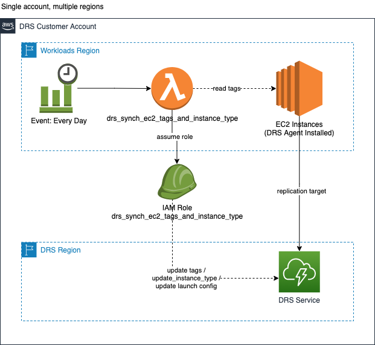
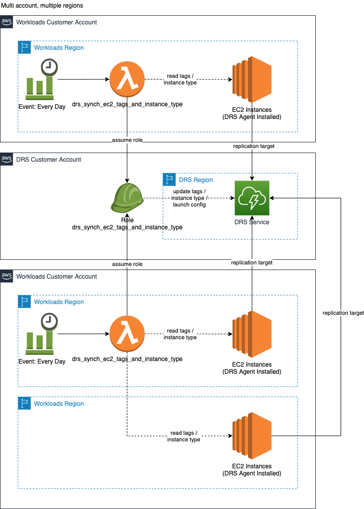
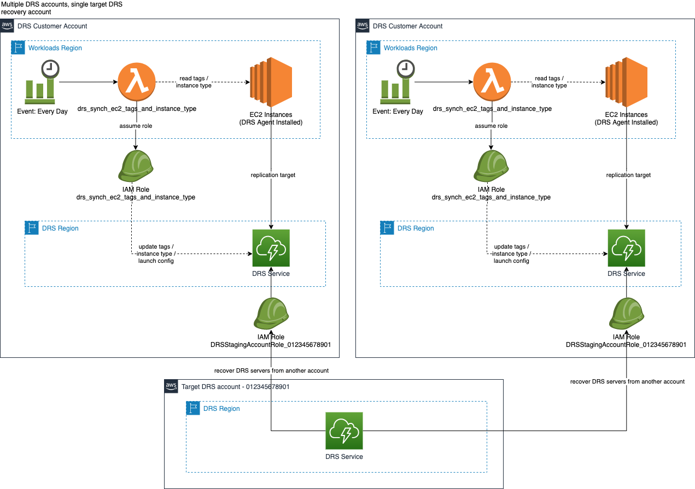
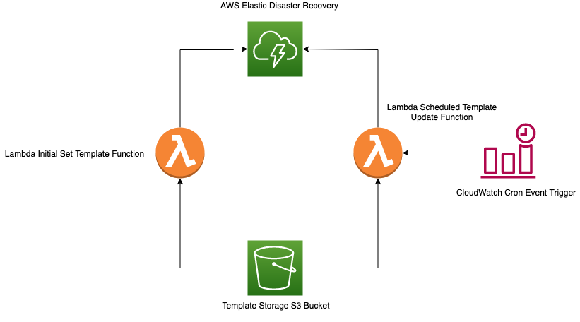

# AWS Elastic Disaster Recovery (DRS) Tools

This repository includes a collection of solutions and tools for the AWS Elastic Disaster Recovery (DRS) service.  You can use one or all of them to customize and enhance your DRS deployments.
 
## [DRS Plan Automation](./drs-plan-automation)
  This solution provides an automated, sequential approach for AWS DRS drills and recoveries.  The solution enables you to plan multiple application recoveries, each with their own recovery order and wait times.  The solution provides a protected, React based user interface to accelerate and simplify use.

  The solution enables you to organize collections of servers by tags in ordered waves, so you can recovery architectural components as groups.  Each wave can also have a sequenced set of PreWave and PostWave automation actions.  Automation actions are defined as SSM Automation runbooks providing broad flexibility for sequenced recovery.  This enables you to support and orchestrate managed services recovery and automation for AWS services such as RDS, Lambda, Route 53, S3, etc either before or after a grouped EC2 recovery completed by DRS.
  
  The solution provides a React based UI requiring authorized login provided by Amazon Cognito.  The solution also uses AWS WAF to limit access to the defined IP addresses / CIDRs that you specify.  The solution uses API Gateway and AWS Lambda to interface with Step Functions for orchestration and DynamoDB for data capture / retrieval.
  
  
    
  The solution uses AWS Step Functions to orchestrate recovery based on your plans defined sequence set of Waves and PreWave / PostWave actions. AWS Lambda is used to drive recovery / automation execution logic.
    
  The following state machine is implemented to coordinate the execution of PreWave Actions, DRS Jobs, and PostWave Actions for DR plan automation.  The state machine is supported by an AWS Lambda function that implements the control logic for the plan automation.  The state machine and lambda function are deployed via CodePipeline using the [drs-automation-plan.yaml](drs-automation-plan/cfn/lambda/drs-automation-plan/drs-automation-plan.yaml) CloudFormation template.
    
  

## [DRS Configuration Synchronizer](./drs-configuration-synchronizer)
  This solution provides a flexible, configuration-based approach for synchronizing launch templates, launch configurations, and replication settings.  It provides many options to override specific servers as well as provide default settings across your DRS servers and support multi-account DRS deployments.

  

  

## [DRS Synch EC2 Tags and Instance Type](./drs-synch-ec2-tags-and-instance-type)
  When you are replicating EC2 instances, the tags from your EC2 instances are not applied to the source servers in the DRS service.  Additionally, the EC2 instance type is not used for the DRS source server.  This script enables you to replicate / synchronize the tags from your EC2 instances to DRS Source Servers.  It also updates the launch template for each source server to correspond to the same EC2 instance type that it originates from.

  

  

  

## [DRS Template Manager](./drs-template-manager)
  When using DRS, every source server has a corresponding launch template. Launch templates cannot be edited in a batch using the native DRS tooling. This solution will enable you to use a single file as a baseline template that can be replicated, edited, and used for each source server tagged with a corresponding key in the DRS console.

  

## [DRS Observability](./drs-observability)
  When you deploy the DRS service, it is important to establish / update your logging and monitoring so you have observability on the health of your DRS deployment.  This folder contains tools such as CloudWatch dashboards and CloudWatch logging configuration that you can use to establish observability for your DRS deployment. 

## Security

See [CONTRIBUTING](CONTRIBUTING.md#security-issue-notifications) for more information.

## License

This library is licensed under the Apache 2.0 License. See the LICENSE file.

