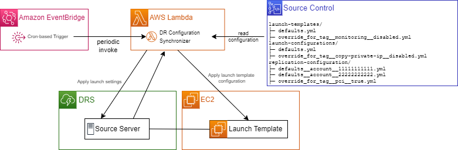
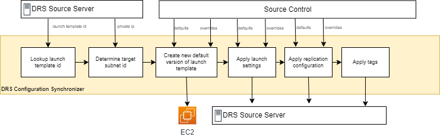

# DRS Configuration Synchronizer

The DRS Configuration Synchronizer (synchronizer) is an AWS Lambda function that runs periodically to ensure that each DRS source server's configuration settings conform to the desired state defined in source control. The synchronizer applies settings based on a set of defaults and optionally applies overrides to certain servers based on the AWS tags.

## Deployment
The synchronizer can be deployed in either a single account or multi-account DRS deployment.   The synchronizer assumes a role in each AWS account where the DRS service is configured to perform synchronization.

### Prerequisites

* [SAM CLI](https://docs.aws.amazon.com/serverless-application-model/latest/developerguide/install-sam-cli.html):  The SAM CLI is used to build and deploy the syncrhonizer lambda function.  Install the SAM CLI following the instructions in the documentation. 
* Python 3:  The deployment script is written in Python and automates the deployment of cloudformation stacks and AWS resource lookups.  With Python3 installed, install the required Python packages in [requirements.txt](./requirements.txt) with the command:
```shell
python3 -m pip install -r requirements.txt --user
```
## Deployment Script
The [deploy.py](./deploy.py) script referenced in the instructions will automate the deployment of CloudFormation stacks for the synchronizer solution.

The following CloudFormation stacks are created: 

* Stack Name: **drs-configuration-synchronizer-lambda**
  * Resources:
    * **AWS Lambda function**:  This lambda function performs the configuration synchronization and is the heart of the solution.

* Stack Name:  **drs-configuration-synchronizer-s3**
  * Resources:
    * **S3 Bucket**:  This S3 bucket is used for storing and managing deployment packages during lambda deployment.  It also is used to store the execution reports for the synchronizer.

* Stack Name:  **drs-configuration-synchronizer-sns-notifications**
  * Resources:
    * **SNS Topic**:  This SNS topic is used for sending notifications on synchronizer execution and results.

* Stack Name:  **drs-configuration-synchronizer-account-role**
  * Resources:
    * **IAM Role**:  This role is assumed by the synchronizer lambda function in each DRS account in order to read and update DRS related configuration resources such as launch templates, DRS launch, and DRS replication configurations.

The following parameter options are supported:
* **```--solution-account <AWS Account ID>```**:  **REQUIRED** - The AWS Account ID where the drs-configuration-synchronizer is deployed.
* **```--prefix <prefix name>```**:  The prefix to preprend in front of each stack name, eg prefix ```myco``` results in stack name ```myco-drs-configuration-synchronizer-lambda```.
* **```--environment <environment name>```**:  The environment name to append to the end of each stack name, eg environment ```dev``` results in stack name ```drs-configuration-synchronizer-dev```.
* **```--account-role-only```**:  Deploy only the IAM role assumed by the synchronizer.  You need to deploy account roles to each DRS account you want the synchronizer to update in addition to deploying the solution.
* **```--cleanup```**:  Cleanup the deployed stacks and AWS resources.  If you deployed with the --prefix or --environment option, then you must cleanup with the same option parameters
* **```--prompt```**:  Whether to prompt and require you to press enter after each stack is deployed.
  
 
### Single Account Deployment
In a single account architecture, you deploy the synchronizer to the AWS account and region where DRS is configured.

1. Rename the default directory under the configuration subdirectory with the same name as your AWS account id (ex: 012345678901)
2. Update the defaults and overrides for [launch configuration settings](#launch-settings-for-drill-recovery-instances), [launch template settings](#ec2-launch-template-settings-for-drill-recovery-instances), and [replication configuration settings](#replication-settings-for-source-servers) to meet your requirements within the directory.
3. Set the **AWS_ACCESS_KEY_ID**, **AWS_SECRET_ACCESS_KEY**, and **AWS_SESSION_TOKEN** AWS environment variables with the appropriate credentials.  You will also need to set the environment variable **AWS_DEFAULT_REGION** to the region you are deploying to.
4. Run the provided python deployment script **deploy.py** with your preferred options:
```shell
python3 deploy.py --solution-account <Your AWS account ID where you are deploying the solution>
```
 
### Multi-Account Deployment
In a multi-account architecture, the synchronizer will assume a role in each configured DRS account.

1. Complete the single account deployment steps for the AWS account where you want the solution to operate. 
2. Copy the single-account subdirectory under the `configuration` subdirectory for each additional AWS account you want to synchronize configurations.
3. Update the files within each AWS account subdirectory as needed.
4. For each additional AWS account the synchronizer should operate on, deploy the IAM role that the synchronizer will assume with the following command:
```shell
python3 deploy.py --account-role-only --solution-account <Your AWS account ID where you are deploying the solution>
```

**NOTE:**  Make sure you update the AWS environment variables with the credentials before deploying to each account.

## Architecture



## Schedule
The synchronizer function is periodically triggered by Rule defined in the AWS EventBridge service. The EventBridge rule defines the schedule using a cron expression. For example, a schedule of cron(0 * * * ? *) triggers the synchronizer every hour.

## Synchronizer Lambda Function
The synchronizer lambda function applies configuration to source servers by reading configuring files from source control, applying any override settings, and then calling APIs for EC2 and DRS to apply the settings for a given source server. This logic is pictured in the figured below.




# Settings

The settings for the solution can be found in the [cfn/lambda/drs-configuration-synchronizer/src/configuration](./cfn/lambda/drs-configuration-synchronizer/src/configuration) folder.


## Launch settings for drill & recovery instances

Launch settings determine how your Drill and Recovery instances will be launched in AWS. They are applied to each source server in DRS. Defaults that should be applied to all source servers are listed in a file named `defaults.yml`. Overrides based on source server tags may be specified in files named `override_for_tag__{TagKey}__{TagValue}.yml`. **NOTE the double underscore between {TagKey} and {TagValue}.**

Launch settings are applied in the following order. 
1. Global defaults (`drs-launch-configurations/defaults.yml`)
2. Tag overrides (in arbitrary order) (`drs-launch-configurations/override_for_tag__{TagKey}__{TagValue}.yml`)

**Example: default launch settings.**

**defaults.yml**
```yaml
copyPrivateIp: true
copyTags: true
launchDisposition: STARTED
licensing:
  osByol: true
targetInstanceTypeRightSizingMethod: BASIC
```

**Example: override copyPrivateIp based on source server tag.**

**override_for_tag__IPAssignment__dynamic.yml**
```yaml
# disable copying private IP from source server
copyPrivateIp: false
```

## EC2 Launch template settings for drill & recovery instances

EC2 launch templates determine specific details of how your Drill and Recovery instances will be launched by the DRS service in AWS. They are applied to each source server in DRS. Defaults that should be applied to all source servers are listed in a file named `defaults.yml`. Overrides based on source server tags may be specified in files named `override_for_tag__{TagKey}__{TagValue}.yml`.  **NOTE the double underscore between {TagKey} and {TagValue}.**

EC2 launch template settings are applied in the following order.
1. Global defaults (`ec2-launch-templates/defaults.yml`)
2. Tag overrides (in arbitrary order) (`ec2-launch-templates/override_for_tag__{TagKey}__{TagValue}.yml`)

### Allowed EC2 launch template settings

The following EC2 launch template settings may be specified. For a list of possible values, please see the `LaunchTemplateData` in [create_launch_template_version](https://boto3.amazonaws.com/v1/documentation/api/latest/reference/services/ec2.html#EC2.Client.create_launch_template_version) section of the boto3 SDK. For details of how these settings relate to DRS, see the [EC2 Launch Template](https://docs.aws.amazon.com/drs/latest/userguide/ec2-launch.html) section of the [DRS user guide](https://docs.aws.amazon.com/drs/index.html).

- `IamInstanceProfile`
- `InstanceType`
- `Monitoring`
- `DisableApiTermination`
- `InstanceInitiatedShutdownBehavior`
- `TagSpecifications`
- `CreditSpecification`
- `CpuOptions`
- `CapacityReservationSpecification`
- `LicenseSpecifications`
- `MetadataOptions`
- `PrivateDnsNameOptions`
- `MaintenanceOptions`
- `DisableApiStop`
- 'SecurityGroupsIds',
- 'NetworkInterfaces'

### Ignored EC2 launch template settings

The following configuration settings are ignored by the DRS synchronizer if specified in configuration files.

- `BlockDeviceMappings` 
- `EbsOptimized`
- `ElasticGpuSpecifications`
- `ElasticInferenceAccelerators`
- `EnclaveOptions`
- `HibernationOptions`
- `ImageId`
- `InstanceRequirements`
- `KernelId`
- `KeyName`
- `NetworkInterfaces`
- `RamDiskId`
- `SecurityGroups`
- `SecurityGroupsIds`
- `UserData`

**Example: default EC2 launch template settings.**

**defaults.yml**
```yaml
MetadataOptions:
  HttpEndpoint: enabled
  HttpTokens: required
  InstanceMetadataTags: enabled
Monitoring:
  Enabled: true
```

**Example: disable CloudWatch detailed monitoring based on source server tag.**

**override_for_tag__monitoring__disabled.yml**
```yaml
# disable monitoring
Monitoring:
  Enabled: false
```

## Automatic Target Subnet Assignment
This feature is of particular value for customers with on-premises networks targeting AWS DRS.  A customer may configure their AWS DRS networking environment to mirror their on-premises network.  The private ip addresses of the origin servers may also need to be the same in the DR environment.

The VPC subnet in which a drill or recovery server is launched is determined by the subnet id specified in the EC2 launch template associated with the DRS source server. The configuration synchronizer automatically populates the subnet id in the EC2 launch template based on the private IP address of the source server and a list of available subnets.

A subnet is considered available based on the following criteria:
- The subnet belongs to a VPC owned by a DRS target AWS account defined in source control
- The VPC of the subnet is tagged with tag key of **drstarget** and a tag value of **true**
- The subnet is tagged with tag key of **drstarget** and a tag value of **true**
- The private IP address of the source server falls within CIDR block of the subnet
- The private IP address of the source server is not an Amazon reserved IP address.


## Replication settings for source servers

Replication settings determine how data is replicated from your source servers to AWS. Default replication settings that should be applied to all source servers are listed in a "global defaults" file named `defaults.yml`. Defaults may also be specified for each AWS account in files named `defaults_for_account_111111111111.yml` where `111111111111` is the AWS account id. Finally, overrides based on source server tags may be specified in files named `override_for_tag__{TagKey}__{TagValue}.yml`.  **NOTE the double underscore between {TagKey} and {TagValue}.**

Replication settings are applied in the following order. 
1. Global defaults (`drs-replication-configurations/defaults.yml`)
2. Account defaults  (`drs-replication-configurations/defaults_for_account_{Account}.yml`)
3. Tag overrides (in arbitrary order) (`drs-replication-configurations/override_for_tag__{TagKey}__{TagValue}.yml`)

### Allowed replication settings

The following replication settings may be specified. For a list of possible values, please see the DRS [update_replication_configuration](https://boto3.amazonaws.com/v1/documentation/api/latest/reference/services/drs.html#drs.Client.update_replication_configuration) section of the boto3 SDK.

- `associateDefaultSecurityGroup`
- `bandwidthThrottling`
- `createPublicIP`
- `dataPlaneRouting`
- `defaultLargeStagingDiskType`
- `ebsEncryption`
- `ebsEncryptionKeyArn`
- `replicationServerInstanceType`
- `replicationServersSecurityGroupsIDs`
- `stagingAreaSubnetId`
- `stagingAreaTags`
- `useDedicatedReplicationServer`

### Ignored replication settings

The following configuration settings are ignored by the DRS synchronizer if specified in configuration files.  

- `PitPolicy`

**Example of a “defaults” file stored in source control.**

**defaults.yml**
```yaml
AssociateDefaultSecurityGroup: true
BandwidthThrottling: 0
CreatePublicIP: false
DataPlaneRouting:
  Value: PRIVATE_IP
DefaultLargeStagingDiskType:
  Value: GP3
ReplicationServerInstanceType: t3.small
EbsEncryption:
  Value: CUSTOM
StagingAreaTags: {}
Tags: {}
UseDedicatedReplicationServer: false
```

**Example of defaults specified for servers in AWS account `111111111111`**.

**defaults_for_account_11111111111.yml**
```yaml
EbsEncryptionKeyArn: arn:aws:kms:us-east-1:111111111111:key/507155b7-550a-4a58-a78f-2d5077df8267
ReplicationServersSecurityGroupsIDs:
  - sg-cb38b29593aa2d8c6f
StagingAreaSubnetId: 
  - subnet-3948f4ba666ae787dd
```

**Example: override bandwidth throttling based on source server tag.**

**override_for_tag__bandwidth-throttling__1000.yml**
```yaml
# limit to 1 Gbps
BandwidthThrottling: 1000
```

## Source Server Tags

Tags for DRS source servers may be applied to source servers by listing them in the file named **server-tag-mapping.csv**.

### server-tag-mapping.csv

The first column specifies the hostname of the DRS source server. The remaining columns specify tag keys and values for each server. 

The following example `server-tag-mapping.csv` shows how two tags, `priority-group` and `pci`, may be applied to DRS source servers.  

| Name    | priority-group | pci   |
|---------|----------------|-------| 
| SERVERA | 0.1            | true  | 
| SERVERB | 0.1            | false | 

## Disabling Synchronizer Features for Servers

DRS synchronizer features may be disabled for a given DRS source server by listing that server's hostname in the file named `config-sync-exclusions.csv`.

If you want to disable a feature for all servers, then only one entry should be made in this file with the Name set to `*`.

### config-sync-exclusions.csv

The first column specifies the hostname of the DRS source server. The remaining columns specify features of the DRS synchronizer that should be disabled for the given server. If a given source server is not listed in this file, then all features are enabled for that server.

The following example `config-sync-exclusions.csv` will disable all features for `SERVERB` and only disable networking configuration for `SERVERA`. 

| Name    | ExcludeAll | ExcludeNetworkConfiguration |
|---------|------------|-----------------------------| 
| SERVERA | false      | true                        | 
| SERVERB | true       |                             | 

You can execute a dry run of the solution by setting Name to `*` and ExcludeAll to `true`.
| Name    | ExcludeAll | ExcludeNetworkConfiguration |
|---------|------------|-----------------------------|
| *       | true       |                             |

You can exclude automatic network configuration for all servers by setting Name to `*` and by setting `ExcludeAll` to `false`, and `ExcludeNetworkConfiguration` to `true`.
| Name    | ExcludeAll | ExcludeNetworkConfiguration |
|---------|------------|-----------------------------|
| *       | false      | true                        |


### Feature Descriptions

| Feature                       | Description                                                                                                                   |
|-------------------------------|-------------------------------------------------------------------------------------------------------------------------------|
| `ExcludeAll`                  | Skip processing of this source server. Overrides all other features.                                                          |
| `ExcludeNetworkConfiguration` | 1. Do not try to find a matching subnet. 2. Do not set subnet/security group on network interface. 3. Set copyPrivateIp=false |


## Summary Report (SNS Notification)

Error reports for each run of the synchronizer may be sent to an SNS topic for further investigation 
by a human. The first 10 errors/warnings occurring within a single execution of the synchronizer are included in the
SNS notification. Additional errors may be viewed by inspecting CloudWatch logs.

Example of an error report:

```
Time synchronizer started: 2022-11-07 17:59:46 UTC
Time synchronizer finished: 2022-11-07 17:59:57 UTC
Duration: 00:00:11
Servers processed: 218

First 10, of 24 total error(s)/warnings(s):

01. {"level":"WARNING","message":"could not find VPC security group for subnet; ignoring subnet","location":"create_subnet_cidr_mapping:249","timestamp":"2022-11-10 20:10:50,944+0000","service":"drs-configuration-synchronizer","account":"111111111111","subnet_id":"subnet-abcdef11111111111","subnet_cidr":"10.0.0.0/24","vpc_id":"vpc-abcdef11111111111","xray_trace_id":"1-636d5ac7-0e816f6d01363b837b6e9984"}

02. {"level":"WARNING","message":"could not find VPC security group for subnet; ignoring subnet","location":"create_subnet_cidr_mapping:249","timestamp":"2022-11-10 20:10:51,062+0000","service":"drs-configuration-synchronizer","account":"111111111111","subnet_id":"subnet-abcdef11111111111","subnet_cidr":"10.254.0.0/19","vpc_id":"vpc-abcdef11111111111","xray_trace_id":"1-636d5ac7-0e816f6d01363b837b6e9984"}

03. {"level":"WARNING","message":"cannot find an ip address that maps to a target subnet","location":"synchronize_launch_template:595","timestamp":"2022-11-10 20:10:51,978+0000","service":"drs-configuration-synchronizer","account":"111111111111","server":"s-abcdef11111111111","host":"myhost1","xray_trace_id":"1-636d5ac7-0e816f6d01363b837b6e9984"}

04. {"level":"WARNING","message":"cannot find an ip address that maps to a target subnet","location":"synchronize_launch_template:595","timestamp":"2022-11-10 20:10:53,229+0000","service":"drs-configuration-synchronizer","account":"222222222222","server":"s-abcdef11111111111","host":"myhost2","xray_trace_id":"1-636d5ac7-0e816f6d01363b837b6e9984"}

05. {"level":"WARNING","message":"cannot find an ip address that maps to a target subnet","location":"synchronize_launch_template:595","timestamp":"2022-11-10 20:10:54,041+0000","service":"drs-configuration-synchronizer","account":"222222222222","server":"s-abcdef11111111111","host":"myhost3","xray_trace_id":"1-636d5ac7-0e816f6d01363b837b6e9984"}
....
```

## Inventory Report (SNS Notification)

A specialized "inventory report" is generated for each execution of the synchronizer. This report contains information
each DRS source servers processed and information about the target VPC subnet configured in the launch template for the
source server. This report is uploaded to Amazon S3 bucket under key `configuration-synchronizer-report.csv`.

Example of an inventory report:

| AwsAccountId | SourceServerId      | Hostname | ExcludeNetworkConfiguration | CopyPrivateIp | SourceServerIp | LaunchTemplateIp | LaunchTemplateSubnet     | LaunchTemplateSecurityGroups |
|--------------|---------------------|----------|-----------------------------|---------------|----------------|-----------------|--------------------------|------------------------------|
| 111111111111 | s-abcdef11111111111 | host123  | false                       | true          | 10.0.0.5       | 10.0.0.5        | subnet-abcdef11111111111 | sg-abcdef11111111111         |
| 222222222222 | s-abcdef22222222222 | hostabc  | true                        | false         | 172.22.0.1     | 10.1.121.31     | subnet-abcdef11111111111 | sg-abcdef11111111111         |


## Development

Automated tests are written for the [pytest](https://pytest.org/) framework library. Execute tests by running the following commands.

### Requirements

- Python 3.8


### virtualenv (PowerShell)

```powershell
python -m venv .venv
.\.venv\Scripts\Activate.ps1
python -m pip install -r requirements.txt
```

### virtualenv (Bash)

```bash
python -m venv .venv
. .venv/bin/activate
python -m pip install -r requirements.txt
```

### Automated tests

```bash
# install testing dependencies
python -m pip install -r requirements-dev.txt
# run all tests
python -m pytest -v
```
