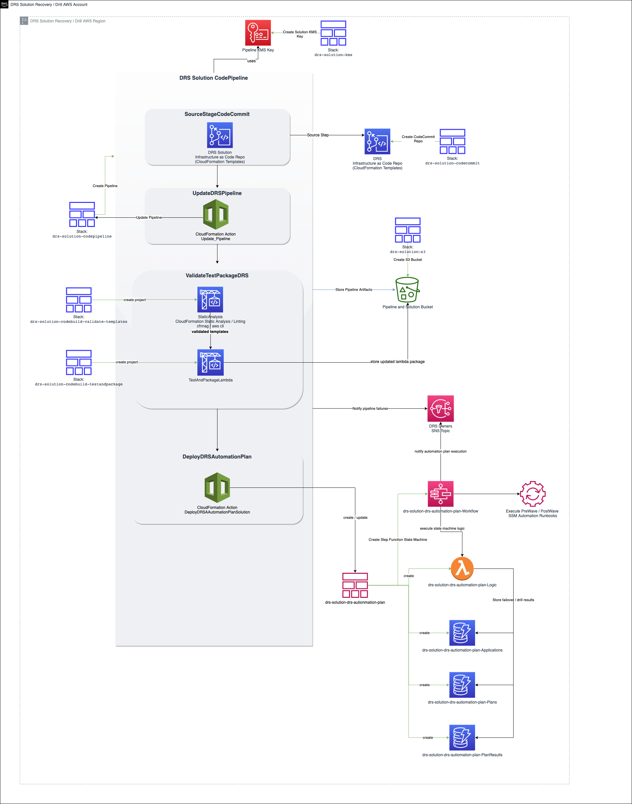
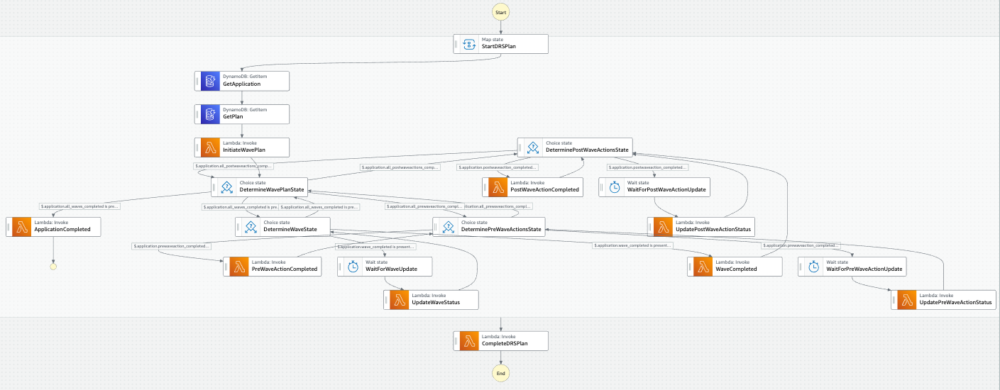

# DR Plan Automation

## Overview
This solution provides an automated, sequential approach for AWS DRS drills and recoveries.  The solution enables you to plan multiple application recoveries, each with their own recovery order and wait times.

The solution is based on the [following AWS blog](https://aws.amazon.com/blogs/storage/creating-a-scalable-disaster-recovery-plan-with-aws-elastic-disaster-recovery/) for more details and a walkthrough of the lambda function.

## CI / CD Architecture

The solution deploys a complete CI/CD management solution using CodeCommit, CodePipeline, CodeBuild, and CloudFormation.  You can use this solution to iteratively develop and enhance your DRS deployment automation plan solution as needed.




## State Machine and control logic for DRS Plan Automation

The following state machine is implemented to coordinate the execution of PreWave Actions, DRS Jobs, and PostWave Actions for DR plan automation.  The state machine is supported by an AWS Lambda function that implements the control logic for the plan automation.  The state machine and lambda function are deployed via CodePipeline using the [drs-automation-plan.yaml](drs-automation-plan/cfn/lambda/drs-automation-plan/drs-automation-plan.yaml) CloudFormation template.   




## Deployment

### 1.  Deploy CodeBuild Projects used by CodePipeline

The solution provides a CI/CD CodePipeline for the testing and deployment of the DRS Plan Automation solution.  CodeBuild projects are used for static analysis, packaging, and deployment of the solution components.  

#### a.  Deploy ValidateTemplates CodeBuild Project

This CodeBuild project performs static analysis on the CloudFormation templates used in the solution using cfn-nag.

You deploy this CodeBuild project using a CloudFormation stack in the home region and account for the solution using the following command from the repository root directory::

        aws cloudformation create-stack \
        --stack-name "drs-solution-codebuild-validate-templates"  \
        --template-body "file://drs-automation-plan/codebuild/ValidateTemplates/codebuild-validate-templates.yaml" \
        --tags "Key"="Application","Value"="DRS Solution" \
        --capabilities CAPABILITY_NAMED_IAM \
        --region <run this command in the home region of your choice>

#### b.  Deploy TestAndPackageLambda CodeBuild Project

This CodeBuild project packages the drs-automation-plan Lambda function used in the solution .

You deploy this CodeBuild project using a CloudFormation stack in the home region and account for the solution using the following command from the repository root directory::

        aws cloudformation create-stack \
        --stack-name "drs-solution-codebuild-test-package-lambda"  \
        --template-body "file://drs-automation-plan/codebuild/TestAndPackageLambda/codebuild-test-package-lambda.yaml" \
        --tags "Key"="Application","Value"="DRS Solution" \
        --capabilities CAPABILITY_NAMED_IAM \
        --region <run this command in the home region of your choice>


### 2.  Deploy CloudFormation service role used by CodePipeline

A separate IAM service role is used by CodePipeline for CloudFormation related deployment operations.  

      aws cloudformation create-stack \
          --stack-name "drs-solution-codepipeline-cloudformation-role"  \
          --template-body "file://drs-automation-plan/CloudFormationRole.yaml" \
          --tags "Key"="Application","Value"="DRS Solution" \
          --capabilities CAPABILITY_NAMED_IAM \
          --region <run this command in the home region of your choice>

### 3.  Deploy SNS topic used by CodePipeline and the solution for notifications

The SNS topic will notify subscribers of pipeline failures.  

      aws cloudformation create-stack \
          --stack-name "drs-solution-sns"  \
          --template-body "file://drs-automation-plan/sns.yaml" \
          --tags "Key"="Application","Value"="DRS Solution" \
          --capabilities CAPABILITY_NAMED_IAM \
          --region <run this command in the home region of your choice>

### 4.  Deploy sample SSM document for PreWave / PostWave Automation Actions

A sample SSM runbook automation has been provided that will create an SSM document called "CreateOpsItem".  This document can be used as an example automation action that can be executed before a wave starts and after a wave completes.  This sample document is referenced in the [sample data](./sample_data) provided by the solution.

      aws cloudformation create-stack \
          --stack-name "drs-solution-ssm"  \
          --template-body "file://drs-automation-plan/ssm.yaml" \
          --tags "Key"="Application","Value"="DRS Solution" \
          --capabilities CAPABILITY_NAMED_IAM \
          --region <run this command in the home region of your choice>


### 5. Deploy CodePipeline

CodeCommit is used by the solution for CI/CD.  CodePipeline uses the CodeCommit repository that you created.

Deploy the CodePipeline for the solution using the following command from the repository root directory:

        aws cloudformation create-stack \
        --stack-name "drs-solution-codepipeline"  \
        --template-body "file://drs-automation-plan/codepipeline.yaml" \
        --tags "Key"="Application","Value"="DRS Solution" \
        --capabilities CAPABILITY_NAMED_IAM \
        --region <run this command in the home region of your choice>

The pipeline will automatically execute using the CodeCommit repository you deployed. CodePipeline deploys the AWS resources used by the solution.  


## Concepts

The primary entities in the solution are Applications, Plans, and Plan Results.  The solution uses DynamoDB as the data store for these entities and the entities are defined using JSON.  

### Applications

The Applications entity is the overarching entity for defining DRS Automation plans.  You can think of an application as a set of AWS DRS source servers for which you want to define and automate recovery plans. 

The JSON object representing an application is defined using the following structure:

```

{
  "AppName": "App1",
  "Description": "Application 1 Description",
  "KeyName": "Application",
  "KeyValue": "App1",
  "OwnerEmail": "myemail@example.com"
}

```

* AppName _(string)_ (REQUIRED):  
  The name of the application.  Use a meaningful name to describe your application.  Application names must be unique.
* KeyName _(string)_ (REQUIRED):  The tag key name to identify the AWS DRS source servers.  Your AWS DRS source servers for this application should have this tag key name defined.
* KeyValue _(string)_ (REQUIRED):  The tag key value to identify the AWS DRS source servers.  Your AWS DRS source servers for this application should have this tag key value defined.
* Description _(string)_:
  A description of your application.   This should describe the business purpose of the application and primary users.
* OwnerEmail _(string)_:  The email address of the owner of the application or the owner of the disaster recovery plan for the application.


### Plans
The plans entity is the primary entity in the DRS solution and defines the recovery plans for an application.  An application can have multiple plans.

The JSON object representing a plan is defined using the following structure:

```
{
  "AppName": "string",
  "PlanName": "string",
  "Waves": [
    {
      "KeyName": "string",
      "KeyValue": "string",
      "UpdateTime": integer,
      "MaxWaitTime": integer,
      "PreWaveActions": [
        {
          "StartAutomationExecution": {
            "DocumentName": "string"
          },
          "UpdateTime": 60,
          "MaxWaitTime": 600
        }
      ],
      "PostWaveActions": [
        {
          "StartAutomationExecution": {
            "DocumentName": "string"
          },
          "UpdateTime": 60,
          "MaxWaitTime": 600
        }      
      ]
    }
  ]
}
```

* AppName _(string)_ (REQUIRED):  
  The name of the application.  This must correspond to the same name used in the Applications table.  
* PlanName _(string)_ (REQUIRED):  
  The name of the plan.  This must be unique for a specific application.  Define a meaningful name for your plan.
* Waves _(array of objects)_ (REQUIRED):
  An array defining the waves for the plan.  The solution will perform drills or recoveries one wave at a time and in order defined within the array.  This allows you to restore servers in a specified order, such as restoring databases first followed by applications that use databases in the next wave.
  * KeyName _(string)_ (REQUIRED):
    The tag key name to identify the AWS DRS source servers for the wave.  The tag key name should be defined for the source servers that should be recovered in this wave.
  * KeyValue _(string)_ (REQUIRED):
    The tag key value to identify the AWS DRS source servers for the wave.  The tag key value should be defined for the source servers that should be recovered in this wave.
  * UpdateTime _(integer)_ (REQUIRED):
    The amount of time to wait before querying the status of the current wave.  
  * MaxWaitTime _(integer)_ (REQUIRED):
    The maximum amount of time to wait before proceeding to the next wave.
  * PreWaveActions _(array of objects)_ (REQUIRED):
    An array defining the actions that should be executed before starting the drill / recovery of DRS source servers for this wave. Each action is executed sequentially, in order. If you don't have any actions that you want to execute before the wave starts, then provide an empty array: "[]"

       * UpdateTime _(integer)_ (REQUIRED):
         The amount of time to wait before querying the status of the current action.
       * MaxWaitTime _(integer)_ (REQUIRED):
         The maximum amount of time to wait before proceeding to the next action.
       * StartAutomationExecution _(object)_
         An SSM Automation Runbook to execute.  All the parameters for the [StartAutomationExecution AWS API](https://docs.aws.amazon.com/systems-manager/latest/APIReference/API_StartAutomationExecution.html) are supported.  See the documentation for details.
            * DocumentName _(string)_ (REQUIRED):
              The name of the SSM document to execute.  

  * PostWaveActions _(array of objects)_ (REQUIRED):
    An array defining the actions that should be executed after the drill / recovery of DRS source servers for this wave. Each action is executed in order, sequentially. If you don't have any actions that you want to execute after the wave completes, then provide an empty array: "[]"

      * UpdateTime _(integer)_ (REQUIRED):
        The amount of time to wait before querying the status of the current action.
      * MaxWaitTime _(integer)_ (REQUIRED):
        The maximum amount of time to wait before proceeding to the next action.
      * StartAutomationExecution _(object)_
        An SSM Automation Runbook to execute.  All the parameters for the [StartAutomationExecution AWS API](https://docs.aws.amazon.com/systems-manager/latest/APIReference/API_StartAutomationExecution.html) are supported.  See the documentation for details.
          * DocumentName _(string)_ (REQUIRED):
            The name of the SSM document to execute.  


### Plan Results

The plan results entity stores the results of a plan execution.  It includes the logs and details from the SSM automations run before and after the wave, the DRS jobs executed for each wave, the wave logs, total execution time, and the State Machine execution id.

The JSON object representing a plan result is defined using the following structure:

