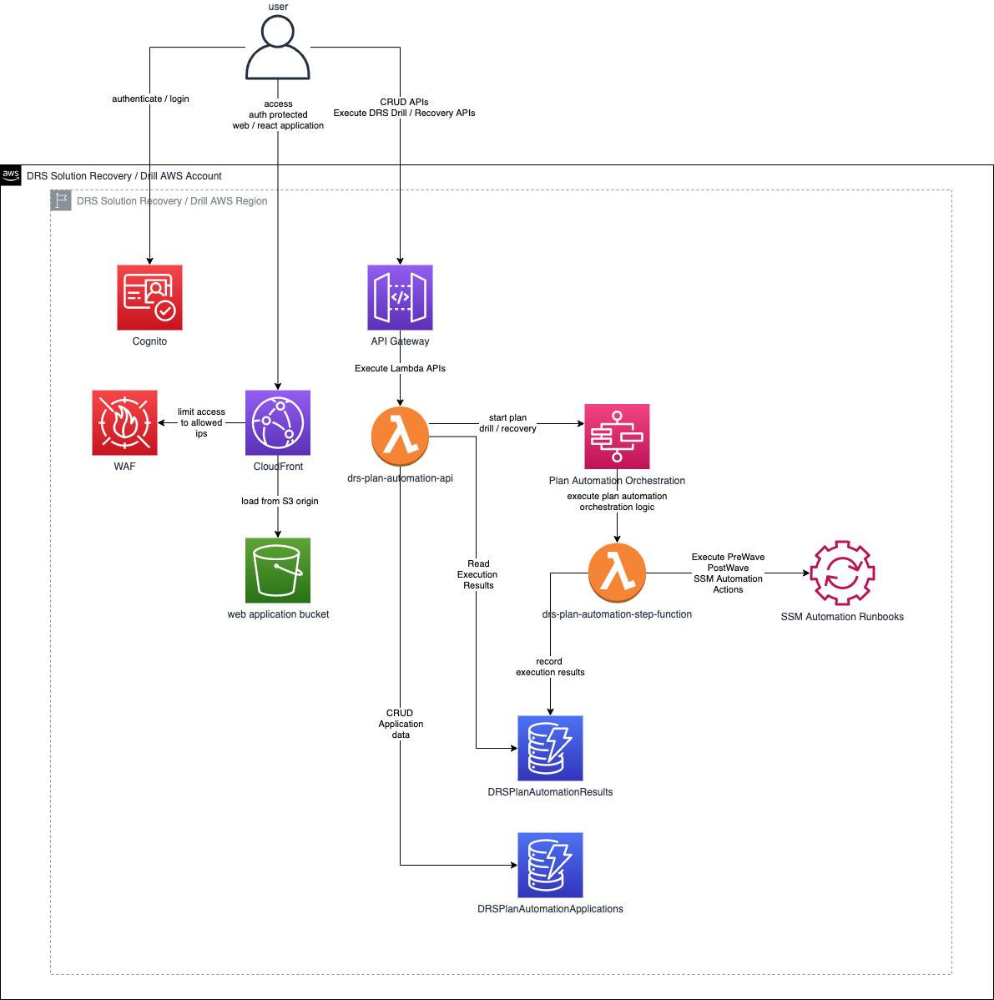
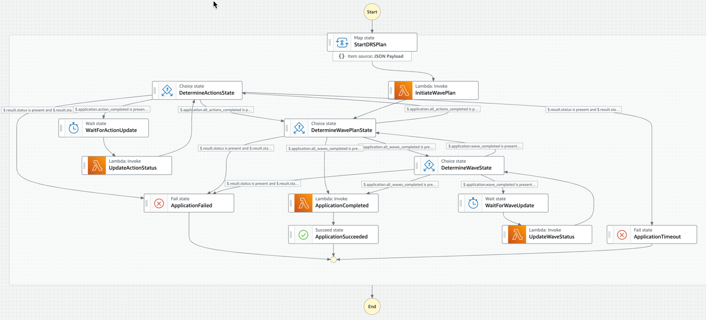
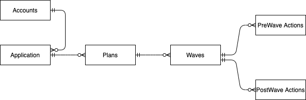
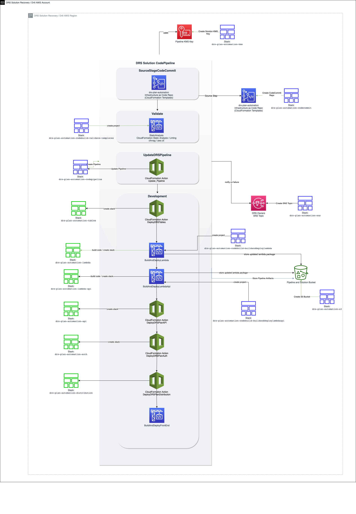

# AWS Elastic Disaster Recovery Service (DRS) Plan Automation Solution

## Overview
This solution provides an automated, sequential approach for AWS DRS drills and recoveries.  The solution enables you to plan multiple application recoveries, each with their own recovery order and wait times.  The solution provides a protected, React based user interface to accelerate and simplify use.

The solution enables you to organize collections of servers by tags in ordered waves, so you can recovery architectural components as groups.  Each wave can also have a sequenced set of PreWave and PostWave automation actions.  Automation actions are defined as SSM Automation runbooks providing broad flexibility for sequenced recovery.  This enables you to support and orchestrate managed services recovery and automation for AWS services such as RDS, Lambda, Route 53, S3, etc either before or after a grouped EC2 recovery completed by DRS.  

## Application Architecture
The solution provides a React based UI requiring authorized login provided by Amazon Cognito.  The solution also uses AWS WAF to limit access to the defined IP addresses / CIDRs that you specify.  The solution uses API Gateway and AWS Lambda to interface with Step Functions for orchestration and DynamoDB for data capture / retrieval.



## State Machine and control logic
The solution uses AWS Step Functions to orchestrate recovery based on your plans defined sequence set of Waves and PreWave / PostWave actions. AWS Lambda is used to drive recovery / automation execution logic.

The following state machine is implemented to coordinate the execution of PreWave Actions, DRS Jobs, and PostWave Actions for DR plan automation.  The state machine is supported by an AWS Lambda function that implements the control logic for the plan automation.  The state machine and lambda function are deployed via CodePipeline using the [drs-automation-plan.yaml](drs-automation-plan/cfn/lambda/drs-automation-plan/drs-automation-plan.yaml) CloudFormation template.



## Data Architecture

The primary entities in the solution are:  Applications, Plans, Waves, PreWave Actions, and PostWave Actions.



The primary entities for results are similar. 

Data is stored in JSON format in DynamoDB.  There are two DynamoDB tables used by the solution:

* **drs-plan-automation-applications**:  This is the primary table used the the solution and defines your Applications and their related Plans, Waves, and PreWave / PostWave Actions.
* **drs-plan-automation-results**:  This table is used to store drill / recovery execution results.

### drs-plan-automation-applications

#### Sample Item
```json
{
  "AppId": "9b1deb4d-3b7d-4bad-9bdd-2b0d7b3dcb6d",
  "AppName": "Sample Application",
  "Description": "Sample Application Description",
  "KeyName": "Application",
  "KeyValue": "sample",
  "Owner": "myemail@example.com",
  "Plans": [
    {
      "PlanId": "9b1deb4d-3b7d-4bad-9bdd-2b0d7b3dcb6a",
      "PlanName": "Sample Plan",
      "Description": "Sample plan for sample application",
      "Owner": "myemail@example.com",
      "RPO": "60",
      "RTO": "1200",
      "CreationDate": "1200",
      "LastModifiedDate": "1200",
      "LastExecutedDate": "1200",
      "Waves": [
        {
          "Name": "Sample Databases Wave",
          "Description": "Start database servers",
          "KeyName": "Role",
          "KeyValue": "DBServer",
          "MaxWaitTime": 900,
          "UpdateTime": 30,
          "PostWaveActions": [
            {
              "Name": "Sample PostWave Action - Database Wave: Create PostWave SSM OpsItem",
              "Description": "Create an SSM Ops Item after DRS wave completes",
              "MaxWaitTime": 90,
              "UpdateTime": 30,
              "StartAutomationExecution": {
                "DocumentName": "CreateOpsItem",
                "Parameters": {
                  "Category": [
                    "Recovery"
                  ],
                  "Description": [
                    "This is a test OpsItem created from a PostWaveAction from the DRS PLan Automation solution Database wave"
                  ],
                  "Priority": [
                    "1"
                  ],
                  "Title": [
                    "DRS Plan Automation PostWaveAction"
                  ]
                }
              }
            }
          ],
          "PreWaveActions": [
            {
              "Name": "Sample PreWave Action - Database Wave: Create PreWave SSM OpsItem",
              "Description": "Create an SSM OpsItem before DRS wave starts",
              "MaxWaitTime": 90,
              "UpdateTime": 30,
              "StartAutomationExecution": {
                "DocumentName": "CreateOpsItem",
                "Parameters": {
                  "Category": [
                    "Recovery"
                  ],
                  "Description": [
                    "This is a test OpsItem created from a PreWaveAction from the DRS PLan Automation solution Database Wave"
                  ],
                  "Priority": [
                    "1"
                  ],
                  "Title": [
                    "DRS Plan Automation PreWaveAction"
                  ]
                }
              }
            }
          ]
        }
      ]
    }
  ]
}
```
* **AppId** _(string)_ --
  A system generated uuid that uniquely identifies each application.  The AppId is the key for the table and is a uuidv4 hash generated by the REST API whenever a new application is created.
* **AppName** _(string)_ --
  The user provided name for the application.
* **Description** _(string)_ --
  The user provided description for the application.
* **KeyName** _(string)_ --
  The Tag Key name that uniquely identifies DRS source servers that are a part of this application.
* **KeyValue** _(string)_ --
  The Tag Key value that uniquely identifies DRS source servers that are a part of this application.
* **Owner** _(string)_ --
  The email address for the owner of this application.
* **Plans** _(array)_ --
  An array of 0 or more plans for the application
  * <a id="planobject"></a>
    * **PlanId** _(string)_ --
      A system generated uuid that uniquely identifies each plan.
    * **Name** _(string)_ --
      The user provided name for the plan
    * **Description** _(string)_ --
      The user provided description for the plan.
    * **KeyName** _(string)_ --
      The Tag Key name that uniquely identifies DRS source servers that are a part of this plan.
    * **KeyValue** _(string)_ --
      The Tag Key value that uniquely identifies DRS source servers that are a part of this plan.
    * **Owner** _(string)_ --
      The email address for the owner of this application.
    * **RPO** _(number)_ --
      The user defined recovery point objective for this plan.
    * **RTO** _(number)_ --
      The user defined recovery time objective for this plan.
    * **CreationDate** _(number)_ --
      The creation date for this plan, in epoch format.
    * **LastModifiedDate** _(number)_ --
      The last modified date for this plan, in epoch format.
    * **LastExecutedDate** _(number)_ --
      The last execution date for this plan, in epoch format.
    * **Waves** _(array)_ --
      An array of 0 or more waves for the plan
      * A Wave Object defining its PreWave Automations, PostWave Automations, and DRS source servers selection by tag.
        * **Name** _(string)_ --
          The user provided name for the wave.
        * **Description** _(string)_ --
          The user provided description for the wave.
        * **KeyName** _(string)_ --
          The Tag Key name that uniquely identifies DRS source servers that are a part of this wave.
        * **KeyValue** _(string)_ --
          The Tag Key value that uniquely identifies DRS source servers that are a part of this wave.
        * **MaxWaitTime** _(number)_ --
          The maximum amount of time to wait for this wave to complete before it is considered a failure.
        * **PreWaveActions** _(array)_ --
          An array of 0 or more PreWave Actions to execute before initiating the DRS job for the wave.
          * A PreWave Action Object describing it and defining the SSM Automation document and parameters
            * **Name** _(string)_ --
              The user provided name for the PreWave action.
            * **Description** _(string)_ --
              The user provided description for the PreWave action.
            * **MaxWaitTime** _(number)_ --
              The maximum amount of time to wait for this wave to complete before it is considered a failure.
            * **UpdateTime** _(number)_ --
              The amount of time to wait before updating the results for this action.
            * **StartAutomationExecution** _(object)_ --
              The SSM Automation Runbook parameters as defined in the [boto3 start_automation_execution function](https://boto3.amazonaws.com/v1/documentation/api/latest/reference/services/ssm.html#SSM.Client.start_automation_execution).
        * **PostWaveActions** _(array)_ --
          An array of 0 or more PostWave Actions to execute after completing the DRS job for the wave.
          * A PostWave Action Object describing it and defining the SSM Automation document and parameters
            * **Name** _(string)_ --
              The user provided name for the PostWave action.
            * **Description** _(string)_ --
              The user provided description for the PostWave action.
            * **MaxWaitTime** _(number)_ --
              The maximum amount of time to wait for this wave to complete before it is considered a failure.
            * **UpdateTime** _(number)_ --
              The amount of time to wait before updating the results for this action.
            * **StartAutomationExecution** _(object)_ --
              The SSM Automation Runbook parameters as defined in the [boto3 start_automation_execution function](https://boto3.amazonaws.com/v1/documentation/api/latest/reference/services/ssm.html#SSM.Client.start_automation_execution).

### drs-plan-automation-results
This table stores the results from a plan automation execution.  

#### Sample Item
```json
{
  "AppId_PlanId": "9b1deb4d-3b7d-4bad-9bdd-2b0d7b3dcb6d_9b1deb4d-3b7d-4bad-9bdd-2b0d7b3dcb6a",
  "ExecutionId": "arn:aws:states:us-west-2:123456789012:execution:DRSPlanAutomationStateMachine-CT5o7CiTLdGG:86f4e81d-e7a8-4319-9ae2-e66916006f9b",
  "AppName": "Sample Application",
  "duration": "20m 44s",
  "ExecutionEndTime": "2022-12-07T19:35:50.311377+00:00",
  "ExecutionStartTime": "2022-12-07T19:15:06.161461+0000",
  "ExecutionStartTimeMs": 1670440506161,
  "isDrill": true,
  "KeyName": "Application",
  "KeyValue": "sample",
  "log": [
  ],
  "Owner": "myemail@example.com",
  "planDetails": {},
  "SourceServers": [
    {
      "s-51d6b65c73391918e": {}
    },
    {
      "s-51d6b65c73391918f": {}      
    }     
  ],
  "status": "completed",
  "topicArn": null,
  "user": "myemail@example.com",
  "Waves": [
    {
      "drs": {
        "job": {},
        "status": "completed"
      },
      "duration": "9m 50s",
      "ExecutionEndTime": "2022-12-07T19:24:56.870974+00:00",
      "ExecutionEndTimeMs": 1670441096871,
      "ExecutionStartTime": "2022-12-07T19:15:06.806098+00:00",
      "log": [
      ],
      "PostWaveActions": [
        {
          "id": "056d109b-0791-4317-85bc-e6cd6edbd80c",
          "job": {
            "AutomationExecutionId": "056d109b-0791-4317-85bc-e6cd6edbd80c",
            "AutomationExecutionStatus": "Success",
            "AutomationType": "Local",
            "DocumentName": "CreateOpsItem",
            "DocumentVersion": "1",
            "duration": "0m 1s",
            "ExecutedBy": "arn:aws:sts::123456789012:assumed-role/drs-plan-automation-lambd-DRSPlanAutomationLambdaR-WE9L727DYBJ0/drs-plan-automation",
            "ExecutionEndTime": "2022-12-07 19:24:58.061000+00:00",
            "ExecutionStartTime": "2022-12-07 19:24:57.211000+00:00",
            "LogFile": "",
            "Mode": "Auto",
            "Outputs": {},
            "ResolvedTargets": {
              "ParameterValues": [
              ],
              "Truncated": false
            },
            "Targets": [
            ]
          },
          "log": [
          ],
          "status": "completed"
        }
      ],
      "PreWaveActions": [
        {
          "id": "c69d3e99-a544-4f94-95d0-81468a531c2d",
          "job": {
            "AutomationExecutionId": "c69d3e99-a544-4f94-95d0-81468a531c2d",
            "AutomationExecutionStatus": "Success",
            "AutomationType": "Local",
            "DocumentName": "CreateOpsItem",
            "DocumentVersion": "1",
            "duration": "0m 1s",
            "ExecutedBy": "arn:aws:sts::123456789012:assumed-role/drs-plan-automation-lambd-DRSPlanAutomationLambdaR-WE9L727DYBJ0/drs-plan-automation",
            "ExecutionEndTime": "2022-12-07 19:15:08.272000+00:00",
            "ExecutionStartTime": "2022-12-07 19:15:07.375000+00:00",
            "LogFile": "",
            "Mode": "Auto",
            "Outputs": {},
            "ResolvedTargets": {
              "ParameterValues": [
              ],
              "Truncated": false
            },
            "Targets": [
            ]
          },
          "log": [
          ],
          "status": "completed"
        }
      ],
      "SourceServers": [
        "s-51d6b65c73391918f",
        "s-5c555d9c008f90131"
      ],
      "status": "completed"
    }
  ]
}
```

* **AppId_PlanId** _(string)_ --
  The key for an execution result is a combination of the AppId (uuid) and PlanId (uuid) seperated by an underscore (_).
* **ExecutionId** _(string)_ --
  The Execute ARN for the DRSPlanAutomationStateMachine for this result.  Each plan execution is orchestrated by the DRSPlanAutomationStateMachine.   
* **AppName** _(string)_ --
  The name of the application when this result was created.
* **duration** _(string)_ --
  The total duration for the plan automation execution, in minutes and seconds (#m #s) 
* **ExecutionEndTime** _(string)_ --
  The end time for the plan automation execution, in ISO 8601 format
* **ExecutionStartTime** _(string)_ --
  The start time for the plan automation execution, in ISO 8601 format
* **ExecutionStartTimeMs** _(number)_ --
  The execution start time in epoch.
* **isDrill** _(boolean)_ --
  Boolean value indicating whether the DRS jobs in each wave should be executed as a drill or a recovery. 
* **KeyName** _(string)_ --
  The Tag key value for the application associated with this result.
* **KeyValue** _(string)_ --
  The Tag key value for the application associated with this result.
* **log** _(array)_ --
  An array of 0 or more log messages associated with this plan execution, such as errors during execution, timeouts, etc
* **Owner** _(string)_ --
  The owner of the application at the time of plan execution.
* **planDetails** _(object)_ --
  The plan object at the time of execution for this result, refer to the [Plan Object](#planobject) in the Applications section for details. 
* **SourceServers** _(array)_ --
  The DRS source servers for the application key name and key value specified.  
  * **"<_SourceServerID_>"** _(object)_ --
    The details for the source server at the time of execution, with key SourceServerID and value set to the object returned by [describe_source_server()](https://boto3.amazonaws.com/v1/documentation/api/latest/reference/services/drs.html#drs.Client.describe_source_servers) 
* **status** _(string)_ --
  The overall status for the plan automation execution.  Possible values are `completed`, `failed`, `timeout` 
* **topicArn** _(string)_ --
  The SNS Topic ARN that will receive plan automation execution status updates.
* **user** _(string)_ --
  The email address of the application owner at the time of execution.
* **Waves** _(array)_ --
  An array of objects containing the results for each wave execution.
  * Wave result (object) 
    * **drs** _(object)_ --
    The DRS job results and status for the wave.  The DRS job for the wave selects DRS source servers tagged with the Tag Key and Tag Value specified for the wave.    
      * **job** _(object)_ --
        The DRS job details for the wave, as returned by ..
      * **status** _(string)_ --
        The status for the DRS job.  Possible values are `completed`, `failed`, `timeout`
    * **duration** _(string)_ --
      The total duration for the plan automation execution, in minutes and seconds (#m #s)
    * **ExecutionEndTime** _(string)_ --
      The end time for the plan automation execution, in ISO 8601 format
    * **ExecutionStartTime** _(string)_ --
      The start time for the plan automation execution, in ISO 8601 format
    * **ExecutionEndTimeMs** _(number)_ --
      The execution start time in epoch.
    * **log** _(array)_ --
      An array of 0 or more log messages associated with this wave execution, such as errors during execution, timeouts, etc
    * **PreWaveActions** _(array)_ --
      An array of objects containing the results for each PreWaveAction execution.
      * PreWaveAction result (object)
        * **job** _(object)_ --
          The SSM Automation Execution details for the PreWaveAction, as returned by ..
        * **status** _(string)_ --
          The status for the PreWaveAction.  Possible values are `completed`, `failed`, `timeout`
        * **log** _(array)_ --
          An array of 0 or more log messages associated with this PreWaveAction execution, such as errors during execution, timeouts, etc
    * **PostWaveActions** _(array)_ --
      An array of objects containing the results for each PostWaveAction execution.
      * PostWaveAction result (object) 
        * **job** _(object)_ --
          The SSM Automation Execution details for the PostWaveAction, as returned by ..
        * **status** _(string)_ --
          The status for the PostWaveAction.  Possible values are `completed`, `failed`, `timeout`
        * **log** _(array)_ --
          An array of 0 or more log messages associated with this PostWaveAction execution, such as errors during execution, timeouts, etc
    * **SourceServers** _(array)_ --
      An array of 0 or more DRS Source Server IDs that will be included in the DRS drill / recovery job for the wave
    * **status** _(string)_ --
      The status for the Wave.  Possible values are `completed`, `failed`, `timeout`

## CI / CD Architecture
The solution deploys a complete CI/CD management solution using CodeCommit, CodePipeline, CodeBuild, and CloudFormation.  You can use this pipeline to iteratively make controlled changes and enhance your plan automation solution as needed.




## Deployment
Deployment is performed by CloudFormation stack deployment and script automation.  A script is provided to automate the deployment steps.

### Prerequisites
* [SAM CLI](https://docs.aws.amazon.com/serverless-application-model/latest/developerguide/install-sam-cli.html):  The SAM CLI is used to build and deploy the lambda functions used in the solution.  These lambda functions are deployed via CodePipeline.  You should install the SAM CLI to enable you to locally test and invoke the deployed lambda functions.  Install the SAM CLI following the instructions in the documentation.
* Python 3:  The deployment script is written in Python and automates the deployment of cloudformation stacks and AWS resource lookups.  With Python3 installed, install the required Python packages in [requirements.txt](./requirements.txt) with the command:
* Elastic Disaster Recovery Service (DRS) initialized in target region:  Before you can start using the DRS service, you must initialize the service by configuring the default settings in your target DR region. [Follow the instructions in the documentation](https://docs.aws.amazon.com/drs/latest/userguide/getting-started-initializing.html).
* Set the environment variables: `AWS_ACCESS_KEY_ID`, `AWS_SECRET_ACCESS_KEY`, `AWS_SESSION_TOKEN` to the AWS account credentials that you want to use to deploy the solution.  You will need sufficient credentials to deploy all the AWS resources used in the solution.

The deployment scripts provided rely on packages defined in [requirements.txt](./requirements.txt).  You can install them with the following command:
```shell
python3 -m pip install -r requirements.txt --user
```

### Solution Deployment Script

A python [deploy.py](./deploy.py) script is provided to automate the deployment of CloudFormation stacks for the solution.

This script deploys all the blue colored stacks in the [CI / CD Architecture diagram](#ci--cd-architecture).  The script concludes by deploying a CodePipeline that deploys the remaining stacks for the solution and defines the basis for future updates.

#### Usage
Run your python interpreter against the `deploy.py` script with the required options.

```shell
python3 deploy.py [OPTIONS]
```
* Options:
* **`--user-email`** - **REQUIRED**: The email address for the cognito user for the solution.  A new temporary password will be sent to this user to login to the solution.
* **`--solution-region`** - **REQUIRED**: The region where the plan automation solution should be deployed.  This should be the same as the target DRS region.
* **`--allowed-cidrs`** - The allowed IP address CIDRs that can access the cloudfront hosted front end interface.  Specifying this option results in a WAF Web ACL being created and attached to the CloudFront Distribution.  If this option isn't specified, then anyone with the URL for the CloudFront distribution will have network access to the user interface.  Login is still required even if you have network access.
* **`--prefix`**: The prefix to preprend in front of each stack name, eg prefix 'myco' results in stack name 'myco-drs-configuration-synchronizer-lambda'
* **`--environment`**: The environment name to append to the end of each stack name, eg environment 'dev' results in stack name 'drs-configuration-synchronizer-dev'
* **`--cleanup`**: Cleanup the deployed stacks and AWS resources.  You must cleanup with the same parameter options that you specified for deployment.
* **`--prompt`**: Whether to prompt and require you to press enter after each stack is deployed.
* **`--help`**: Show this message and exit.

## Sample Application and Sample Environment
The solution includes a sample application and environment, so you can quickly explore and test out the solution.


The sample application and environment deploys the following resources:

* [AWS EC2 environment](./samples/sample_environment/source.yaml):  This CloudFormation template sets up networking and deploys 3 EC2 instances, each with different tags identifying their roles and correlating to a separate wave in the sample application.
  * 1 VPC (CIDR 10.0.0.0/16)
  * 1 Internet Gateway
  * 1 Public Subnet (CIDR 10.0.0.0/24)
  * 3 EC2 Launch Templates
    * Amazon Linux 2
    * t3.micro
    * user data configured to install DRS agent
    * Tags
      * Name: `sample-dbserver-instance` | `sample-webserver-instance` | `sample-appserver-instance`
      * Application: `sample`
      * Role: `DBServer` | `AppServer` | `WebServer`
      * Purpose: `drs-plan-automation-demo-source`
  * 3 Fleets of EC2 instances with 1 instances each:  `sample-dbserver-instance` | `sample-webserver-instance` | `sample-appserver-instance`

**NOTE**:  EC2 instance tags are not replicated to the corresponding DRS source servers in the DRS service.  These tags are required on the source servers so that the plan automation solution can select the right source servers for plan execution.  You can automate the replication of EC2 instance tags to corresponding DRS source servers using the [drs-synch-ec2-tags-and-instance-type solution](https://github.com/aws-samples/drs-tools/tree/main/drs-synch-ec2-tags-and-instance-type)

* [One Application DynamoDB Item Record](./samples/sample_data/sample_application.json):  This application record aligns to the sample EC2 environment,  all three EC2 instances align to the `Application: sample` tag used to identify the application.  Additionally, each EC2 instance is tagged with a `Role` tag aligning it to each wave.
  * Application: sample - All three EC2 instances in the sample environment are tagged with `Application: Sample`
  * 1 Plan:
    * 3 Waves
      * Role: DBServer - One EC2 instance is tagged with `Role: DBServer`
        * 1 PreWave Action:  Create SSM OpsItem
        * 1 PostWave Action:  Create SSM OpsItem
      * Role: AppServer - One EC2 instance is tagged with `Role: AppServer`
        * 1 PreWave Action:  Create SSM OpsItem
        * 1 PostWave Action:  Create SSM OpsItem
      * Role: WebServer - One EC2 instance is tagged with `Role: WebServer`
        * 1 PreWave Action:  Create SSM OpsItem
        * 1 PostWave Action:  Create SSM OpsItem

* [One Application Result Item record](./samples/sample_data/sample_result.json):  This result record demonstrates the Plan Results view without requiring you to initiate a drill / recovery.  NOTE:  The links in the result will not work since they are not linked to your deployment.  You can execute a new drill / recovery to product an actual result with working links.

### Sample Application Deployment Script

The [deploy_sample.py](./deploy_sample.py) python deployment script can be used to automate the sample application and environment deployment.

Run your python 3 interpreter against the `deploy_sample.py` script with the required options.

```shell
python3 deploy_sample.py [OPTIONS]
```

Options:
* **```--source-region```**:  **REQUIRED** - Specify the AWS region where the sample AWS EC2 environment should be deployed.  This will be a region different from your DRS / DR region. (e.g. us-east-1)
* **```--solution-region```**:  **REQUIRED** - Specify the AWS region where the solution has been deployed.  This should be the same AWS region where DRS is configured. (e.g. us-west-2)
* **```--help```**:  Display and describe valid parameter options
* **```--prefix <prefix name>```**:  The prefix to preprend in front of each stack name, eg prefix ```myco``` results in stack name ```myco-drs-plan-automation-s3```.
* **```--environment <environment name>```**:  The environment name to append to the end of each stack name, eg environment ```dev``` results in stack name ```drs-plan-automation-dev-s3eiifccugtdlhleijhckbijbeikffrhcdnjejfdegfhhd
* **```--cleanup```**:  Cleanup the deployed stacks and AWS resources.  You must cleanup with the same parameter options that you specified for deployment.
* **```--prompt```**:  Whether to prompt and require you to press enter after each stack is deployed.


## Usage

Once the solution is deployed, CodePipeline will execute and deploy the remaining resources through the pipeline.

Wait until the pipeline successfully completes execution.  Once the pipeline has completed execution, proceed to Amazon CloudFront in the AWS Management Console.

Copy the CloudFront distribution URL and open it within a browser.  

**NOTE**:  If you used the `--allowed-cidrs` option when you deployed the solution, then you will only be able to access the user interface if your ip address is within the range specified. 

Check the email address that you specified with the `--user-email` option.  You should have received an email with subject **Your temporary password** from Amazon Cognito.  You will need to login with this password.  Cognito user registration is disabled by default.  Once you login you will be required to change the password.

If you deployed the sample application with the [deploy_sample.py](./deploy_sample.py) script, then you will have a sample application already created in the solution.  If not, you can proceed to create an application, plan, and associated waves.


## Develop and test locally

You can enhance and develop the front end interface and lambda functions used in the solution locally.

You should clone the CodeCommit repository that was created for you with the deployed solution.  The CodeCommit repository is linked to CodePipeline to initiate a deployment on commit to the `main` branch.

You should develop and test locally against your cloned CodeCommit repository in a feature branch.  When you are ready to integrate your changes you should commit, push, and merge the branch into the main branch to initiate a deployment.  

### Frontend React Interface Local Development

Follow these steps to configure, deploy, develop, and test the solution locally.

1.  Update the [aws-exports.js](./fe/src/aws-exports.js) file with your deployed Amazon Cognito User Pool configuration.
    You must update the config file with your deployed cognito user pool so that your locally deployed interface can authenticate you.
2.  Install the application package dependencies
    Install the application dependencies by:
    a. Change to the src directory:  `cd fe/src`
    b. Install the dependencies: `npm install`
3.  Start the local webserver.  You can serve the frontend interface locally with:  `npm start`
4.  Make changes to the front end code.  As you make changes to the front end code, the local server will hotload the changes so you can iterate and update the solution.


## Troubleshooting

* ### I am getting a 403 error when trying to access the CloudFront distribution
  Make sure your ip address is within the IP address range for the CIDR block you specified when you deployed the solution with the `--allowed-cidrs` option.

