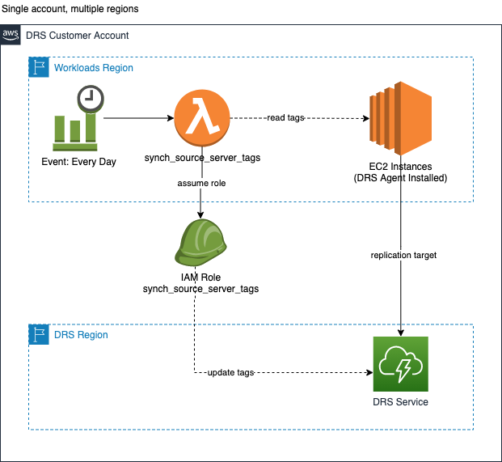
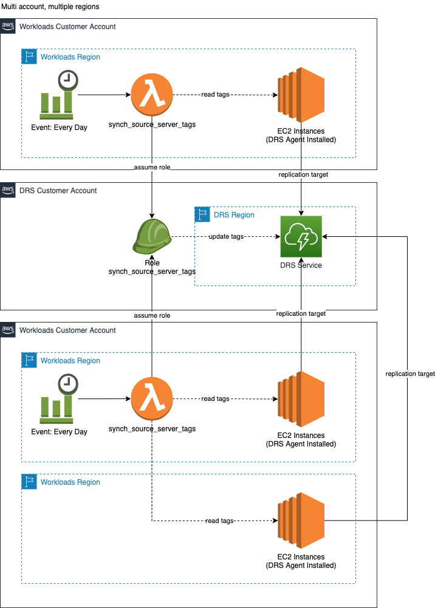

# Synch Source Server Tags

## Description

This solution enables you to synchronize the tags from your EC2 instances running in the same AWS account or different AWS accounts to your source servers in the AWS Elastic Disaster Recovery Service.

Tagging your source servers with the same tags as your EC2 instances enables you to organize your DRS source servers by important attributes such as which application / workload that they correspond to.  Tags can help you to coordinate the sequence of server recovery as well as what automation needs to be applied before or after the source servers are recovered.

When you perform a failover for your EC2 instances, you also want to preserve their EC2 tags and apply those same tags to newly provisioned failover instances.  Applying the same tags can also help you with cost reconciliation and tracking that you may be performing using Cost Allocation Tags.

The solution also adds the following tags to each updated DRS source server:
* **source:account**:  The AWS Account ID where the EC2 instance is running.
* **source:region**:  The AWS region where the EC2 instance is running.
* **source:instance-id**:  The AWS instance id for the origin EC2 instance.

# Architecture
You can synch the source server tags from EC2 instances running in the same account or from different accounts / regions than your AWS DRS account.

## Single account, multiple regions
In a single account scenario, you should deploy the DRS service in a region that is different from your AWS EC2 instance region(s).  This improves your resilience posture when your EC2 instance region(s) becomes unavailable.



## Multiple accounts, multiple regions
In a multi account scenario, you have deployed the DRS service into a separate AWS account and region from your AWS EC2 instance accounts and regions.



# Configuration

Configuration is accomplished via AWS environment variables.  These are set when the [synch_source_server_tags_lambda.yaml](synch_source_server_tags_lambda.yaml) AWS Lambda function is deployed via the parameter options presented by the CloudFormation template:

* **DRS_ASSUME_ROLE_NAME**: The name of the AWS IAM role that the synch_source_server_tags AWS Lambda function assumes in the DRS account.  This role grants the AWS lambda function rights to describe the DRS source servers and update the tags.   
* **DRS_ACCOUNT_NUMBER**: The AWS account ID where the DRS service is configured and replicating EC2 instances.
* **DRS_REGION**:  The AWS Region where the DRS service is configured and replicating EC2 instances.
* **SOURCE_ACCOUNT**:   The AWS account ID containing the source EC2 instances that are being replicated to DRS.  You should not need to update this value, it is automatically identified by CloudFormation as the account where the lambda function is deployed.
* **SOURCE_REGIONS**:  A comma separated list of AWS regions containing the source EC2 instances that are being replicated to DRS.  You should update this value to reflect the regions where your source EC2 instances are running.  You can update this value via the related CloudFormation parameter.

# Deployment

## Single account

Deploy the provided [synch_source-server_tags](synch_source_server_tags_role.yaml) role to your account in a region of your choice (e.g. us-east-1).  Specify your AWS account number for parameter **SourceAccountNumber**.  Leave the parameter **OrganizationID** blank, it is used in multi-account scenarios.  Next, deploy the [synch_source_server_tags_lambda.yaml](synch_source_server_tags_lambda.yaml) AWS Lambda function into a region of your choice (e.g. us-east-1) in your account.  The Lambda function only needs to be deployed once in order to support multiple regions within an AWS account.

1. Deploy the **synch_source_server_tags** role into your AWS DRS Account in a region of your choice.  This role is assumed by the **synch_source_server_tags** Lambda function to update the tags on DRS source servers.
    Specify your account number for the **SourceAccountNumber** parameter. 

```shell
aws cloudformation create-stack --stack-name drs-synch-source-server-tags-role \
--template-body file://synch_source_server_tags_role.yaml \
--parameters ParameterKey=SourceAccountNumber,ParameterValue="<AWS Account ID where the DRS service is configured, dont specify OrganizationID if you use this >" \
--capabilities CAPABILITY_NAMED_IAM \
--region <enter the region where the stack should be deployed, e.g. "us-east-1">
```


2. Deploy **synch_source_server_tags** Lambda function into a region of your choice.  Specify your account number for the **DrsAccountNumber** parameter.  Specify the region the DRS service is configured in for the **DrsRegion** parameter.  Specify the region(s) containing the EC2 instances that are replicating to DRS as a comma separated list for parameter **SourceRegions**.

```shell
aws cloudformation create-stack --stack-name drs-synch-source-server-tags \
--template-body file://synch_source_server_tags_lambda.yaml \
--parameters ParameterKey=DrsAccountNumber,ParameterValue="<AWS Account ID where DRS is configured>" \
ParameterKey=DrsRegion,ParameterValue="<AWS Region where the DRS service is configured, eg: us-west-2>" \
ParameterKey=SourceRegions,ParameterValue="<Comma separated list of the AWS regions in this AWS account containing EC2 instances whose tags you want to synchronize, eg: us-east-1, us-east-2>" \
--capabilities CAPABILITY_NAMED_IAM \
--region <enter the region where the stack should be deployed, e.g. "us-east-1">
```

## Multi-Account

Deploy the provided [synch_source-server_tags](synch_source_server_tags_role.yaml) role to the AWS DRS account.  Specify the AWS Organization ID for parameter **OrganizationID**.  Leave the parameter **SourceAccountNumber** blank.  Next, deploy the [synch_source_server_tags_lambda.yaml](synch_source_server_tags_lambda.yaml) AWS Lambda function into a region of your choice (e.g. us-east-1) in each AWS account containing EC2 instances that are replicating to DRS.  You can use a CloudFormation service-managed StackSet to automate deployment to new AWS accounts in your AWS Organization so that new accounts are automatically setup with the solution.  

1. Deploy the **synch_source_server_tags** role into the AWS account where DRS is configured in a region of your choice.  This role is assumed by the **synch_source_server_tags** Lambda function running in your AWS Accounts containing your EC2 instances replicating to DRS.  
   Specify your AWS Organization ID for the **OrganizationID** parameter, this will enable the role to be assumed by any AWS account within your AWS Organization.

```shell
aws cloudformation create-stack --stack-name drs-synch-source-server-tags-role \
--template-body file://synch_source_server_tags_role.yaml \
--parameters ParameterKey=OrganizationID,ParameterValue="<AWS organization ID for the AWS account where the DRS service is configured, dont specify SourceAccountNumber if you use this >" \
--capabilities CAPABILITY_NAMED_IAM \
--region <enter the region where the stack should be deployed, e.g. "us-east-1">
```

2. Deploy the **synch_source_server_tags** Lambda function into **each AWS account** containing EC2 instances that are replicating to DRS.  Specify the account number where DRS is configured for the **DrsAccountNumber** parameter.  Specify the region where the DRS service is configured for the **DrsRegion** parameter.  Specify the region(s) containing the EC2 instances that are replicating to DRS as a comma separated list for parameter **SourceRegions**.

```shell
aws cloudformation create-stack --stack-name drs-synch-source-server-tags \
--template-body file://synch_source_server_tags_lambda.yaml \
--parameters ParameterKey=DrsAccountNumber,ParameterValue="<AWS Account ID where DRS is configured>" \
ParameterKey=DrsRegion,ParameterValue="<AWS Region where the DRS service is configured, eg: us-west-2>" \
ParameterKey=SourceRegions,ParameterValue="<Comma separated list of the AWS regions in this AWS account containing EC2 instances whose tags you want to synchronize, eg: us-east-1, us-east-2>" \
--capabilities CAPABILITY_NAMED_IAM \
--region <enter the region where the stack should be deployed, e.g. "us-east-1">
```
